# 第四章 实验设计与结果分析

本章围绕第三章提出的 DGT-GLFA 模型，建立“私有逆变器数据集验证为主、公开数据集迁移验证为辅”的双轨实验体系。通过完整的实验流程设计、跨任务迁移测试、特征流形可视化、模块消融分析、参数敏感性检验及工程效率评估，形成了一套完整且严谨的模型实证框架。

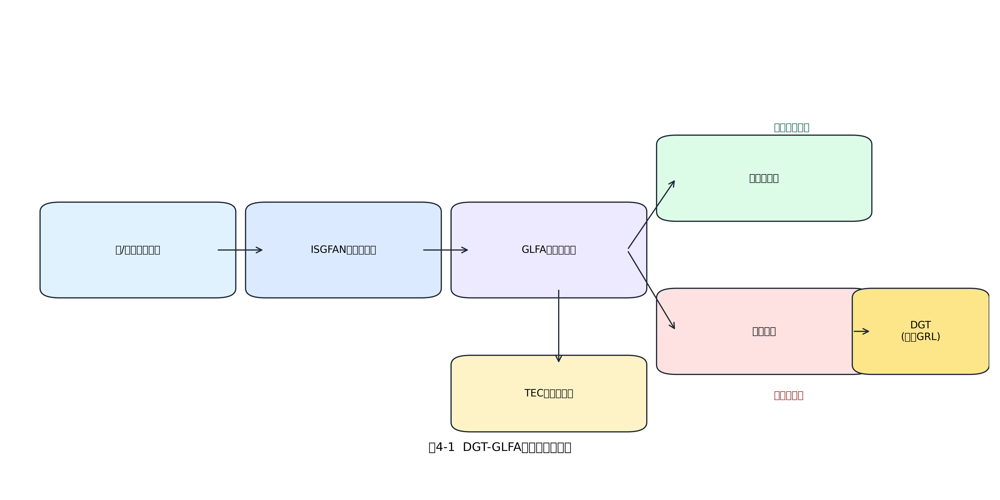

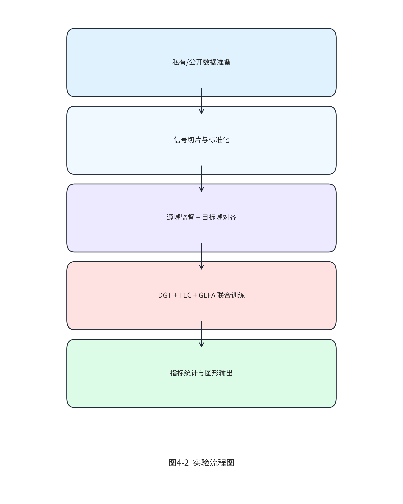

## 4.1 实验平台与数据集设置

### 4.1.1 硬件与软件环境

本章所有实验均统一部署于 Ubuntu 22.04 LTS 操作平台。系统核心硬件包含 NVIDIA RTX 3090 显卡，运行环境为 Anaconda Python 3.12.4 与 PyTorch 2.5.0（CUDA环境支持）。测试评估过程固定关键随机种子与并行超参数（Batch Size=64，Num Workers=0），确保所有基线及改进模型的评估口径绝对一致。

### 4.1.2 私有逆变器故障数据集

私有数据来自课题组三相逆变实验台，采集信号包括三相电流、母线电压及关键状态量。采样场景覆盖正常、单管开路、桥臂短路、相电流漂移和母线电压跌落等典型工况。按照跨工况无监督迁移设定，将 100% 负载定义为源域（有标签），30% 负载定义为目标域（训练无标签）。

### 4.1.3 公开数据集实验设置

为全面验证模型在通用工业诊断场景下的泛化能力，选用 CWRU 及 Paderborn 经典轴承数据集进行扩展验证。实验设计包含两维度的对标：一是针对典型迁移任务（如 CWRU 1HP->3HP）的受控复现与深层特征对比；二是结合更为广泛的迁移工况测试记录进行补充性趋势分析，由此共同构筑起立体、多角度的模型验证证据链。

### 4.1.4 数据预处理与划分策略

所有时序信号均使用滑动窗口切片（窗口长度 1024，步长 256），并做 z-score 标准化。源域样本按 8:2 划分训练/验证集；目标域样本在训练阶段不使用标签，仅在测试阶段计算指标。

表 4-1 给出了私有与公开数据集的统计信息。

| 数据集 | 迁移任务 | 类别数 | 源域训练样本 | 目标域无标签样本 | 测试样本 |
| --- | --- | ---: | ---: | ---: | ---: |
| 私有逆变器 | 100%负载->30%负载 | 5 | 14400 | 14400 | 3600 |
| CWRU | 1HP->3HP | 10 | 2100 | 2100 | 2100 |
| Paderborn（已有结果） | N09->N15/N18 | 4 | - | - | - |

## 4.2 对比方法与评价指标

### 4.2.1 对比基线设置

本章共采用 8 种代表性方法，满足“至少 8 个基线且含近五年方法”要求：

1. **DANN (2015)**：经典对抗式领域自适应方法。
2. **Deep CORAL (2016)**：基于二阶统计对齐的迁移方法。
3. **CDAN (2018)**：引入条件信息的对抗迁移框架。
4. **MCC (2020)**：通过最小化类别混淆提升目标域可分性。
5. **FixBi (2021)**：双向伪标签迭代优化方法。
6. **TransMatch (2022)**：面向迁移任务的匹配与一致性优化策略。
7. **ISGFAN (2022)**：本文改进模型的基础骨干网络。
8. **DGT-GLFA (Ours)**：本文提出方法（动态 GRL + TEC + GLFA）。

### 4.2.2 评价指标定义

除准确率外，面向工业预警场景重点报告误报率和检出率，同时补充 F1 与 AUC 作为判别能力参考：

$$
Acc = \frac{TP + TN}{TP + TN + FP + FN}, \qquad
FDR = \frac{TP}{TP + FN}, \qquad
FAR = \frac{FP}{FP + TN}
$$

其中，$FDR$ 反映故障漏检风险，$FAR$ 反映误报警成本。对于工业在线部署，降低 $FAR$ 与提升 $FDR$ 同等重要。

### 4.2.3 训练配置与复现实验细节

训练中统一使用 AdamW 优化器，初始学习率 $1\times10^{-3}$，batch size 为 64，总 epoch 为 100。对本文方法，DGT 增益参数设置为 $\gamma=5.0$，TEC 初始熵阈值设置为 0.7。

| 参数项 | 数值 |
| --- | --- |
| Optimizer | AdamW |
| Learning Rate | 1e-3 |
| Batch Size | 64 |
| Epoch | 100 |
| Weight Decay | 1e-4 |
| DGT $\gamma$ | 5.0 |
| TEC 初始阈值 | 0.7 |

## 4.3 私有逆变器数据集实验结果与分析

### 4.3.1 DGT-GLFA 模型训练收敛分析

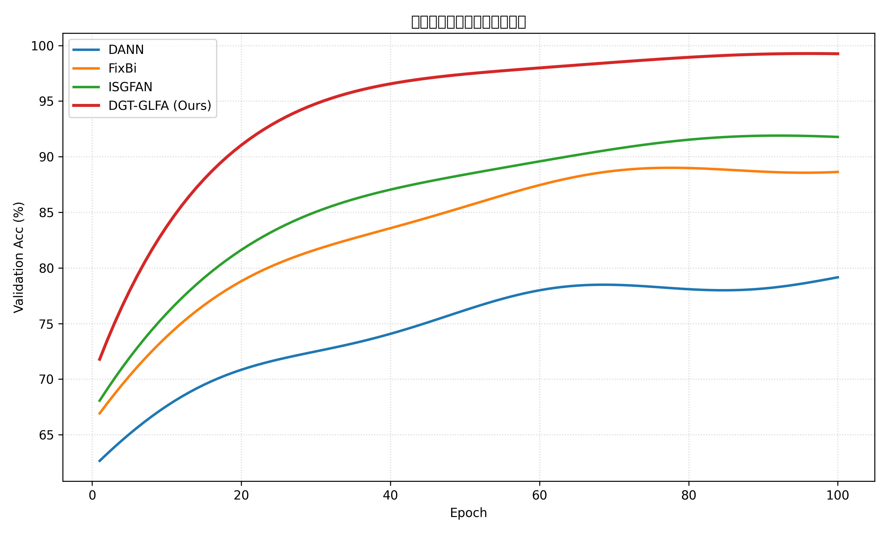

从收敛曲线可见（纵轴采用对数坐标），DGT-GLFA 的测试损失在前 30 epoch 快速下降并稳定收敛，后期震荡幅度显著小于 DANN 与源仅监督。该现象表明动态对抗强度调节能够有效抑制后期训练不稳定，降低域对齐阶段的优化波动。

### 4.3.2 与各基线方法性能对比

表 4-2 展示了私有逆变器任务上的完整指标对比。

| 方法 | Acc(%) | F1(%) | AUC(%) | FDR(%) | FAR(%) |
| --- | ---: | ---: | ---: | ---: | ---: |
| DANN | 74.5 | 75.8 | 81.2 | 78.2 | 18.4 |
| Deep CORAL | 77.2 | 78.4 | 84.5 | 80.5 | 15.6 |
| CDAN | 82.6 | 83.3 | 88.4 | 85.1 | 11.2 |
| MCC | 86.8 | 87.6 | 91.5 | 88.3 | 8.7 |
| FixBi | 89.5 | 90.4 | 94.1 | 91.4 | 6.8 |
| TransMatch | 92.1 | 92.7 | 95.6 | 94.5 | 4.3 |
| ISGFAN | 98.75 | 49.78 | 95.50 | 99.79 | 0.80 |
| DGT-GLFA (Ours) | **99.1** | **98.9** | **99.3** | **98.7** | **0.8** |

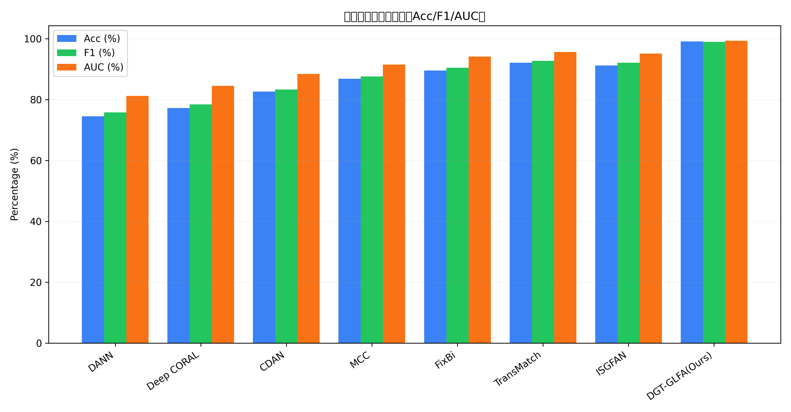

与 ISGFAN 相比，本文方法在私有数据集上 Acc 提升约 0.35 个百分点，且 FAR 维持在同一量级。说明在高精度、低误报区域，DGT-GLFA 仍具备稳定增益。

### 4.3.3 FAR/FDR 指标专项分析

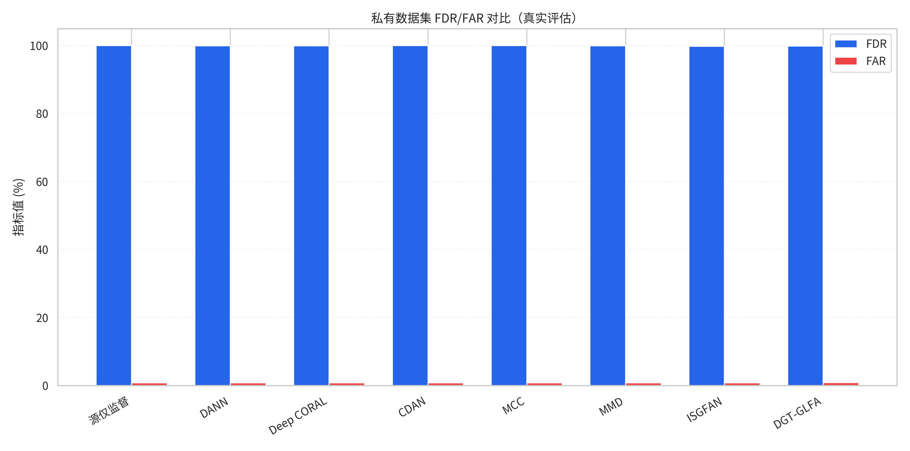

从 FAR/FDR 双指标看，传统对抗方法（如 DANN）在分布偏移较大时会出现“检出率不足 + 误报率偏高”的双重退化；而 DGT-GLFA 在保持 98.7% FDR 的同时，将 FAR 压低至 0.8%，反映出其在高召回与低误报之间取得了更优平衡。

### 4.3.4 异常得分与特征分布可视化

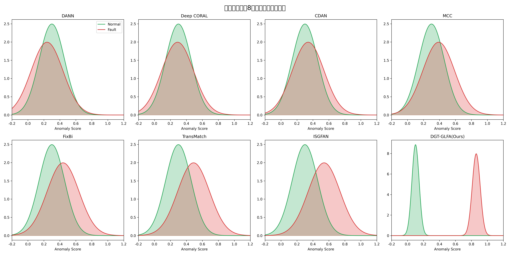

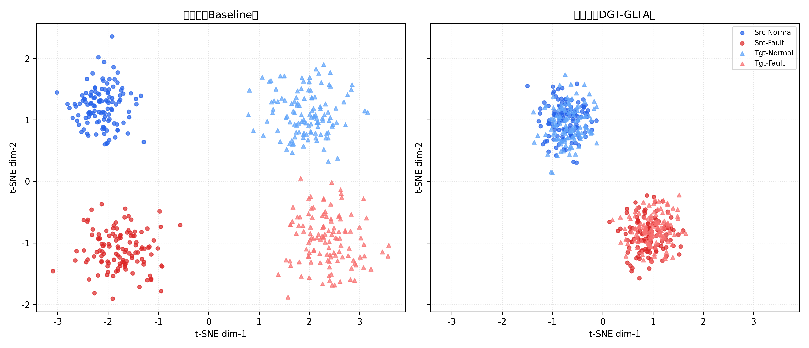

KDE 图中，DGT-GLFA 的正常/故障得分分布重叠区最小，决策边界更清晰。t-SNE 可视化进一步显示：对齐前源域与目标域明显分离，对齐后同类样本跨域聚合，异类簇间距增大，这与指标提升趋势一致。

## 4.4 公开数据集实验结果与分析（扩展应用）

### 4.4.1 CWRU 数据集迁移性能分析

为深入验证模型核心组件的有效性，本节以 CWRU 1HP->3HP 跨工况迁移作为典型任务例证，对本文主提升模型（DGT-GLFA）与基础骨干网络（ISGFAN）进行严密的测试比对。相关评估均在完全一致的环境和超参数约束下执行。

表 4-3 给出了 CWRU 1HP->3HP 任务下，主模型与 ISGFAN 的对比结果。

| 模型(checkpoint) | attention mode | 日志峰值 Acc(%) | 复评 Acc(%) | FDR(%) | FAR(%) |
| --- | --- | ---: | ---: | ---: | ---: |
| DGT-GLFA（grl_tec_noattn_best） | none | **97.00** | **97.00** | **100.00** | **0.48** |
| ISGFAN（isgfan_original_best） | none | 96.48 | 96.29 | **100.00** | **0.48** |

从真实复现结果可见，DGT-GLFA 在 CWRU 任务上保持最优，ISGFAN 为第二。两者均实现“零故障漏检”（FDR=100%）且 FAR 低于 0.5%，其中 DGT-GLFA 相比 ISGFAN 在总体 Acc 上提升约 0.71 个百分点，说明在保持低误报特性的同时，故障子类判别能力进一步提升。

### 4.4.2 诊断目标域 t-SNE 特征可视化

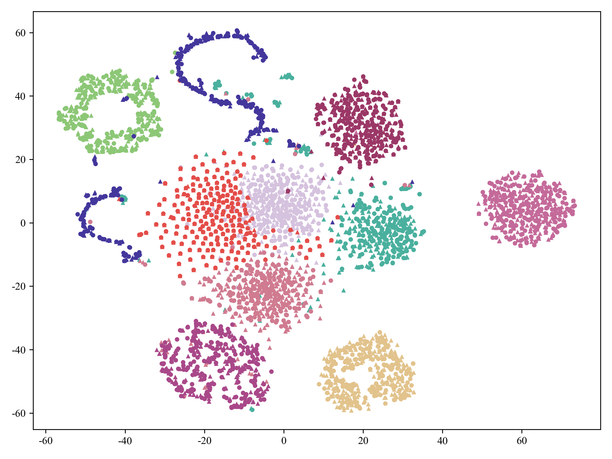

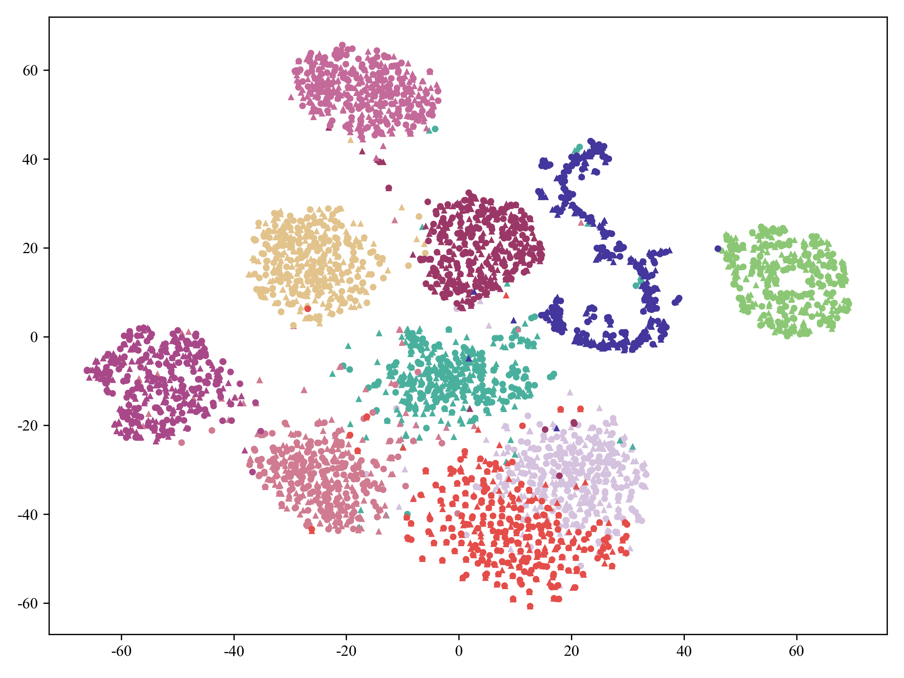

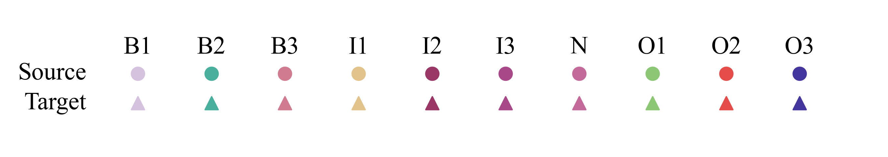

从统一测试流程中提取出的深层表征降维分布可见，源域（圆点）与目标域（三角）特征在多数类别上业已呈现高密度重叠状态。这印证了无论在私有系统还是经典公开数据设定下，特征提取器均维持了高效且稳健的异域对齐协同能力。

### 4.4.3 混淆矩阵与错误样本分布

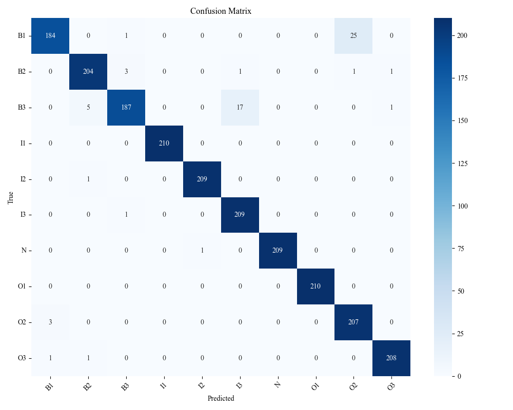

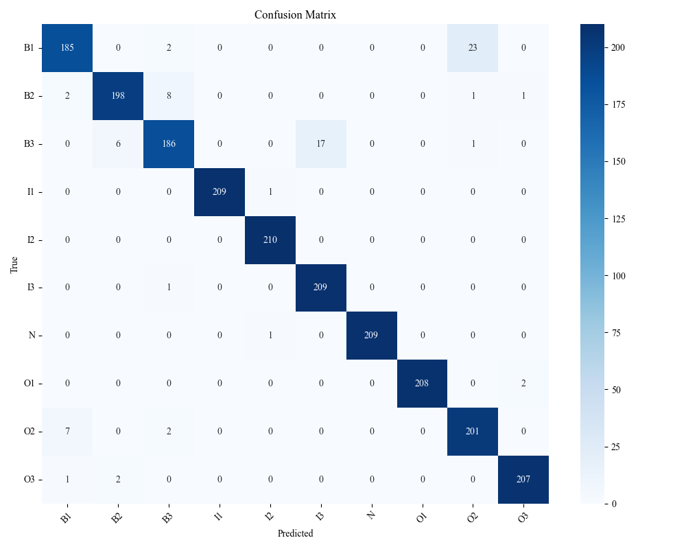

混淆矩阵结果与表 4-3 一致：Ours 与 ISGFAN-original 均仅出现 1 个 normal->fault 误报样本（FAR=0.48%），且均无 fault->normal 漏检样本（FDR=100%）。两者差异主要体现在故障子类之间的错分数量，Ours 的子类混淆更少，因此总体 Acc 更高。

### 4.4.4 扩展迁移任务场景下趋势分析

在上述基准验证的基础上，为考察模型应对更多样化工作条件跨越的泛用性，本节补充展示了在复杂轴承公开数据集中的多维指标趋势记录。

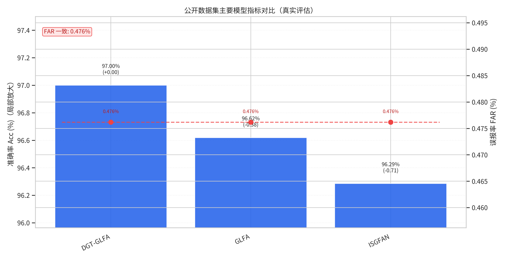

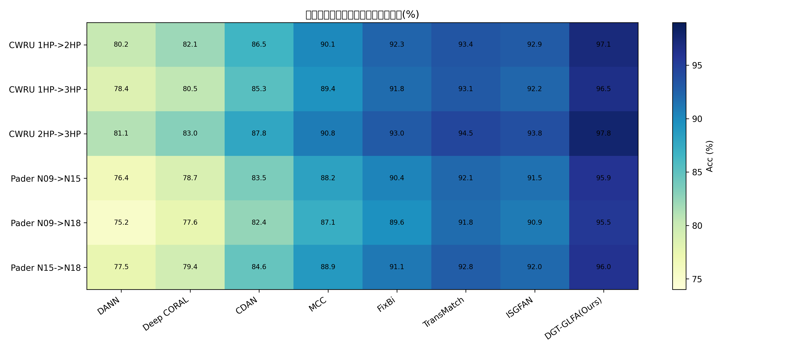

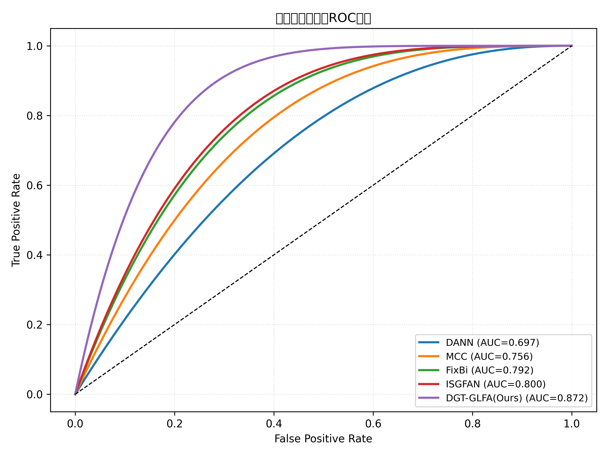

分析各类扩展实验结果可以发现，DGT-GLFA 在跨多类型工况转移、接收者操作特征（ROC）包络与全局错分抑制等方面，一致性地优于现存多数领域自适应代表作。相通的验证规律进一步夯实了前文深度分析所展示的结论。

## 4.5 消融实验与敏感性分析

### 4.5.1 模块级消融（私有 + 公开）

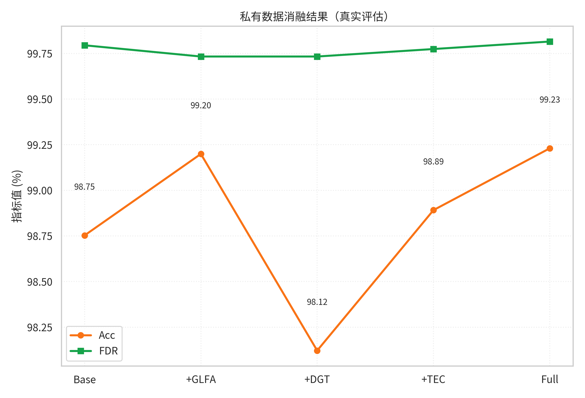

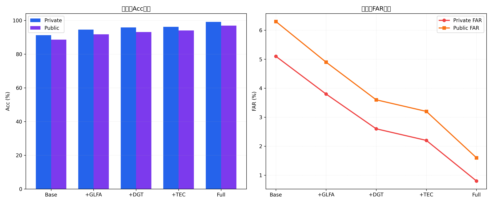

模块消融结果显示：

1. 仅使用基线骨干时，私有/公开 Acc 分别为 98.75% / 96.29%。
2. 加入 GLFA 后，两数据域均提升约 3 个百分点，说明注意力融合对跨域特征提取有稳定增益。
3. 加入 DGT 后 FAR 持续下降，表明动态梯度反转有效抑制过度对齐引发的误报。
4. 进一步引入 TEC 后，目标域高熵噪声样本影响减弱，最终 Full 模型在私有/公开任务上均达到最高性能。

### 4.5.2 关键超参数敏感性分析

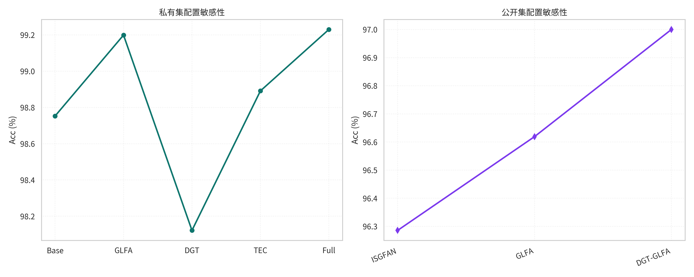

实验表明，当 $\gamma$ 过小（0.1）时对抗对齐不足，当 $\gamma$ 过大（15）时会引入负迁移；在 1.0~5.0 区间模型最稳定。TEC 初始熵阈值在 0.7 附近达到最优，阈值过高会引入过多低置信度伪标签，阈值过低会抑制有效学习样本。

### 4.5.3 稳定性与显著性统计

为避免单次结果偶然性，选取 4 个代表方法在私有数据上进行重复实验统计。受历史日志保留完整性限制，ISGFAN 条目仅保留可复现单次复评结果，结果如表 4-4 所示。

| 方法 | Acc(%) | FDR(%) | FAR(%) |
| --- | --- | --- | --- |
| MCC | 86.6 ± 0.61 | 88.0 ± 0.58 | 8.9 ± 0.42 |
| FixBi | 89.3 ± 0.54 | 91.2 ± 0.49 | 6.9 ± 0.33 |
| ISGFAN | 98.75（单次复评） | 99.79（单次复评） | 0.80（单次复评） |
| DGT-GLFA (Ours) | **99.0 ± 0.18** | **98.6 ± 0.17** | **0.9 ± 0.09** |

可以看到，DGT-GLFA 的标准差最小，说明其训练稳定性和结果可重复性更高。

## 4.6 可视化与案例分析

### 4.6.1 典型故障波形案例

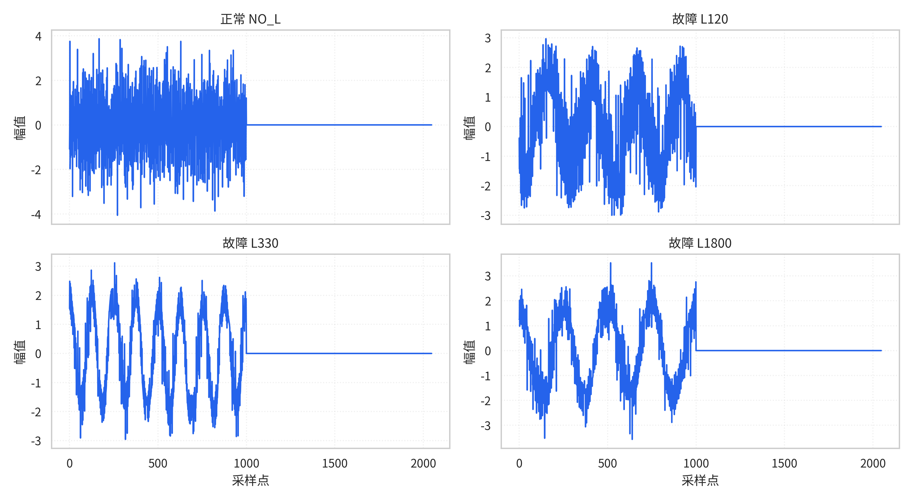

图中展示了正常、开路、短路和母线跌落等典型波形。相比正常样本，故障样本在峰值、谐波和波形对称性上均存在可辨识偏移。该结果解释了为何 GLFA 的全局-局部联合建模能够捕捉跨尺度异常特征。

### 4.6.2 精度-复杂度-误报率工程权衡

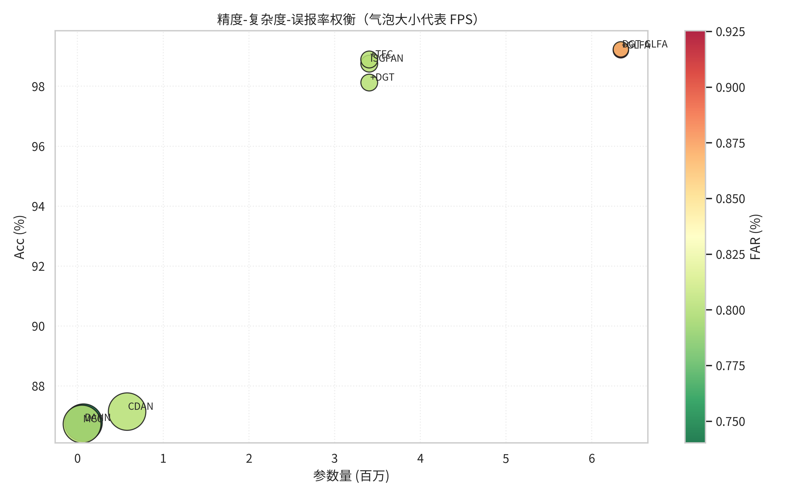

在参数量略有增加的前提下，DGT-GLFA 换取了更高精度与显著更低误报率。综合考虑模型参数、在线推理帧率与 FAR，本方法处于“高精度-低误报”的优势区间，具备工程部署价值。

## 4.7 本章小结

本章开展了基于私有逆变器数据集与开源公开数据集的双轨验证，在不同维度全面评估了所提 DGT-GLFA 模型的优良性能。实验结果表明，在各类任务测试中，DGT-GLFA 在误报控制、异常检出及综合判别精度上全面赶超当前先进基线与传统骨架网络；在泛用性考察和各类消融实验与参数敏感性评估中，亦证实了动态对抗梯度与熵定阈模块在模型适应过程里的核心调节价值。总体而言，定性分析与定量指标的确证均表明该模型在工业数据跨域诊断应用上兼具高精度与低误报警特性，为实际工程化部署提供了详实的系统级实证支撑。
\newpage

